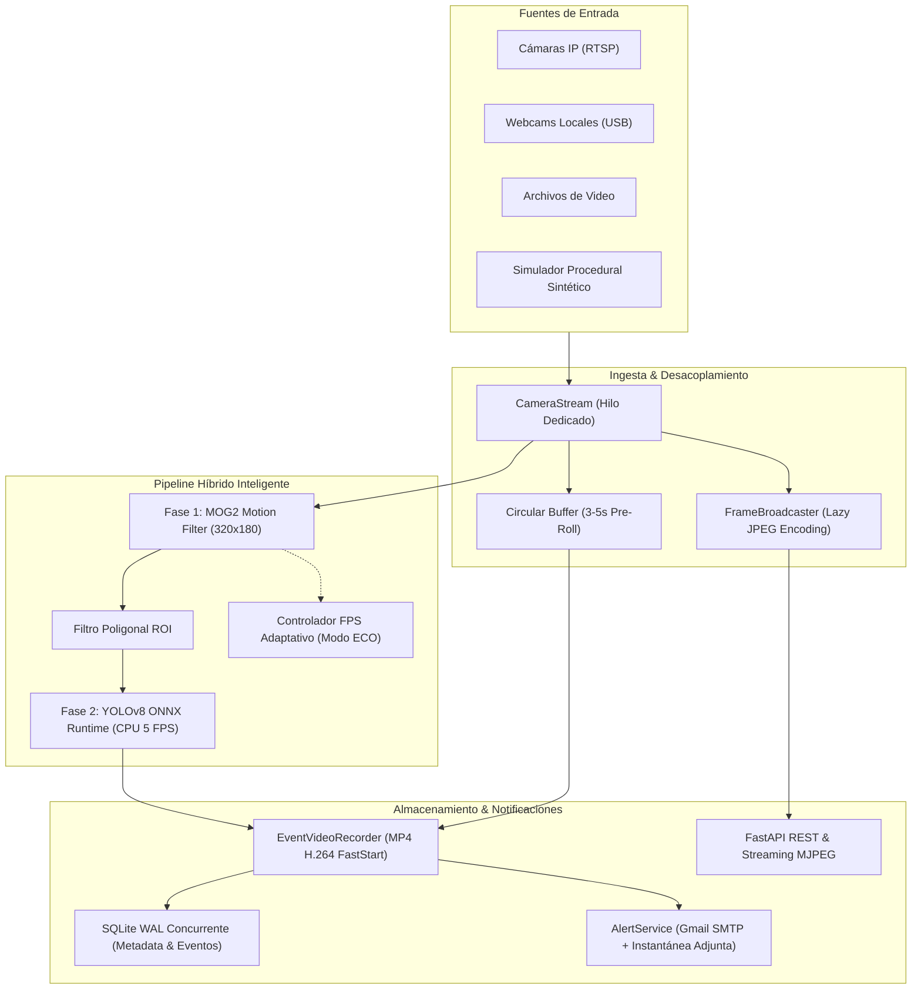

<div align="center">

# 📹 Smart NVR — Sistema de Videovigilancia Inteligente Modular

**Plataforma de Videovigilancia Residencial y PyME de Alto Rendimiento impulsada por IA, Visión Computacional y FastAPI**

[](https://github.com/jyersonrp/proyecto-videovigilancia-inteligente/actions/workflows/ci.yml)
[](https://github.com/jyersonrp/proyecto-videovigilancia-inteligente/stargazers)
[](https://github.com/jyersonrp/proyecto-videovigilancia-inteligente/network/members)
[](https://www.python.org/)
[](https://fastapi.tiangolo.com/)
[](https://opencv.org/)
[](https://onnxruntime.ai/)
[](LICENSE)
[](CONTRIBUTING.md)

[Características](#-características-principales) • [Arquitectura](#-arquitectura-del-sistema) • [Benchmarks](#-comparativa-y-rendimiento) • [Instalación](#-instalación-rápida) • [Dashboard](#-guía-del-dashboard-web) • [API REST](#-referencia-de-la-api-rest) • [Contribuir](#-contribución)

</div>

---

## 💡 ¿Por Qué Smart NVR?

Los sistemas NVR tradicionales y las soluciones en la nube suelen ser costosos, consumir demasiados recursos de hardware o requerir suscripciones mensuales que comprometen la privacidad. **Smart NVR** resuelve estos problemas ofreciendo:

- 🛡️ **100% Privado y Auto-Alojado**: Todo el video, las grabaciones y la base de datos se procesan localmente sin depender de servidores de terceros.
- ⚡ **Modo ECO & FPS Adaptativo**: Ahorro de más del **70% de CPU en reposo**, escalando instantáneamente a 15 FPS ante movimiento o cuando un usuario mira el streaming en vivo.
- 🧠 **Pipeline Híbrido en Dos Fases**: Filtra sombras y ruido con OpenCV MOG2 sobre 320x180, disparando YOLOv8 sobre CPU únicamente cuando hay movimiento dentro de la zona de interés (ROI).
- 🎬 **Grabación con Pre-Roll (3-5s)**: Almacena el incidente completo en MP4 H.264 estándar (incluyendo los segundos previos a la detección) sin saturar el almacenamiento.
- 🌐 **Dashboard Web Integrado sin Node.js**: Single Page Application nativa, rápida y ligera construida con Tailwind CSS y HTML5 Canvas servida directamente por FastAPI.

---

## 📊 Comparativa y Rendimiento

| Característica | NVR Comercial Clásico | Script Básico OpenCV | Soluciones Cloud (Ring/Nest) | **Smart NVR (Este Proyecto)** |
|---|:---:|:---:|:---:|:---:|
| **Costo Mensual** | $0 | $0 | $5 - $15 / cámara | **$0 (Open Source)** |
| **Consumo CPU en Reposo** | 40% - 70% | 80% - 100% | N/A | **< 5% por cámara (Modo ECO)** |
| **Latencia de Streaming** | 1 - 3 seg | 1 - 2 seg | 2 - 5 seg | **< 200 ms (MJPEG Nativo)** |
| **Falsas Alarmas** | Frecuentes | Muy frecuentes | Bajas | **Mínimas (MOG2 + YOLOv8)** |
| **Privacidad de Video** | Media | Alta | Baja (Servidores externos) | **100% Local y Privada** |
| **Buffer Pre-Roll** | Costoso | Inexistente | Limitado | **Incluido (3 a 5 seg en RAM)** |

---

## 🏛 Arquitectura del Sistema



---

## ⚡ Optimizaciones de Alto Rendimiento

### 🌿 FPS Adaptativo (Modo ECO)
- Cuando una cámara no registra movimiento, no está grabando y no hay usuarios visualizándola en el dashboard, el bucle de procesamiento desciende automáticamente de 15 FPS al modo de reposo ecológico (**4 a 5 FPS**), reduciendo las ejecuciones de MOG2 y descarte de frames en un **~73%**.
- **Detección por Demanda**: Al detectarse movimiento, al activarse una grabación o cuando un usuario abre la transmisión en el navegador, el procesamiento escala instantáneamente a la tasa objetivo máxima (**15 FPS**).
- **Período de Gracia**: Tras cesar la actividad, la cámara se mantiene a 15 FPS durante 3 segundos antes de retornar al modo reposo para prevenir fluctuaciones.

### 💤 Codificación JPEG Perezosa (Lazy Encoding)
- **Cero Compresión en Bucle Muerto**: Elimina la compresión síncrona innecesaria (`cv2.imencode`) cuando ningún cliente web tiene abierta la vista de streaming.
- **Compresión Bajo Demanda con Caché**: Si se solicita una instantánea (`/api/cameras/{id}/snapshot`) o se conecta un nuevo visor, se ejecuta una única compresión puntual y se guarda en caché hasta que arribe un nuevo fotograma.

---

## 🚀 Instalación Rápida

### 1. Clonar el Repositorio
```bash
git clone https://github.com/jyersonrp/proyecto-videovigilancia-inteligente.git
cd proyecto-videovigilancia-inteligente
```

### 2. Crear y Activar Entorno Virtual
```bash
# Windows (PowerShell)
python -m venv .venv
.\.venv\Scripts\Activate.ps1

# Linux / macOS
python3 -m venv .venv
source .venv/bin/activate
```

### 3. Instalar Dependencias
```bash
pip install -r requirements.txt
```

### 4. Configurar Variables de Entorno
Copia la plantilla `.env.example`:
```bash
# Windows
copy .env.example .env

# Linux / macOS
cp .env.example .env
```

---

## ▶️ Puesta en Marcha

Inicia el servidor NVR con un solo comando:
```bash
python run_server.py
```

O alternativamente mediante Uvicorn:
```bash
uvicorn smart_nvr.api.app:create_app --factory --host 0.0.0.0 --port 8000
```

Accede a las interfaces en tu navegador:
* 🌐 **Dashboard Web**: [http://localhost:8000/](http://localhost:8000/)
* 📚 **Documentación Interactiva Swagger**: [http://localhost:8000/docs](http://localhost:8000/docs)
* 📖 **Documentación ReDoc**: [http://localhost:8000/redoc](http://localhost:8000/redoc)

---

## 🖥️ Módulos del Dashboard Web

El panel interactivo se organiza en 4 secciones principales:

1. **🔴 En Vivo (Live Grid)**:
   - Cuadrícula adaptable multi-cámara con vista en tiempo real y ajuste dinámico.
   - Insignias interactivas de estado ONLINE/PAUSADA, FPS efectivo y modo **`🌿 ECO`**.
   - Efecto visual de pulso ante la presencia confirmada de personas o vehículos.
   - Controles rápidos para capturar fotogramas, pausar cámaras o acceder a pantalla completa.

2. **📁 Historial de Eventos (Events Gallery)**:
   - Galería de tarjetas con miniaturas, fecha, hora, duración y etiquetas de clasificación.
   - Barra de filtrado avanzado por cámara, rango de fechas, clase de objeto y confianza mínima.
   - Reproductor modal de video HTML5 con soporte de desplazamiento temporal instantáneo (*HTTP 206 Range requests*).
   - Botón de papelera para eliminar clips individuales y botón para purgar archivos huérfanos.

3. **📐 Cámaras & Regiones de Interés (ROI Editor)**:
   - Selector de cámara con carga del fotograma de referencia sobre `<canvas>`.
   - Herramienta interactiva para trazar polígonos delimitando la zona de vigilancia.
   - Deslizadores para calibrar sensibilidad MOG2, área mínima y umbral de confianza de la IA en tiempo real.

4. **⚙️ Configuración & Alertas**:
   - Formulario para configurar el servidor Gmail SMTP, puerto, usuario, contraseña de aplicación y destinatarios.
   - Ajuste del tiempo de enfriamiento (*cooldown*) para evitar saturación de correos.
   - Botón de prueba de envío de correo con diagnóstico inmediato.
   - Asistente para dar de alta nuevas cámaras (RTSP, USB o sintéticas) con prueba previa de conexión.

---

## 📡 Referencia de la API REST

### Cámaras (`/api/cameras`)
| Método | Endpoint | Descripción |
|---|---|---|
| `GET` | `/api/cameras` | Lista todas las cámaras con métricas en tiempo real (FPS, modo ECO, suscriptores, alertas). |
| `POST` | `/api/cameras` | Registra una nueva cámara e inicia su pipeline de captura. |
| `GET` | `/api/cameras/{id}` | Obtiene detalles y métricas de una cámara específica. |
| `PUT` | `/api/cameras/{id}` | Actualiza parámetros de la cámara o alterna su estado de activación/pausa. |
| `DELETE` | `/api/cameras/{id}` | Detiene la cámara, elimina sus registros en BD y purga sus archivos multimedia. |
| `POST` | `/api/cameras/test-connection` | Prueba de conexión no destructiva (RTSP, USB, archivo, sintético). |
| `GET` | `/api/cameras/{id}/snapshot` | Descarga una captura instantánea en formato JPEG (codificada bajo demanda). |
| `GET` | `/api/cameras/{id}/detection-config` | Lee la configuración actual de MOG2, IA y polígonos ROI. |
| `PUT` | `/api/cameras/{id}/detection-config` | Actualización en caliente de sensibilidad, umbral y ROIs sin reinicio. |

### Streaming en Vivo (`/api/cameras/{id}/stream`)
| Método | Endpoint | Descripción |
|---|---|---|
| `GET` | `/api/cameras/{id}/stream` | Stream MJPEG nativo (`multipart/x-mixed-replace`) de ultrabaja latencia. |

### Incidentes y Eventos (`/api/events`)
| Método | Endpoint | Descripción |
|---|---|---|
| `GET` | `/api/events` | Consulta paginada con filtros por cámara, fecha, clase de detección y confianza. |
| `GET` | `/api/events/{id}` | Detalle completo del evento con lista de detecciones y logs de alertas. |
| `DELETE` | `/api/events/{id}` | Elimina el evento de la BD y borra físicamente el video MP4 y la imagen del disco. |
| `POST` | `/api/events/purge-orphaned` | Purga del disco clips huérfanos que no corresponden a ningún evento registrado. |
| `POST` | `/api/events/sync-disk` | Sincroniza clips existentes en disco con el historial de eventos de la BD. |
| `GET` | `/api/events/{id}/video` | Streaming del video MP4 con soporte de cabeceras HTTP 206 (Range requests). |
| `GET` | `/api/events/{id}/snapshot` | Descarga la instantánea JPEG anotada con bounding boxes. |

---

## 🧪 Pruebas Automatizadas

El proyecto cuenta con una sólida batería de pruebas herméticas con **pytest** que cubren toda la arquitectura:

```bash
# Ejecutar pruebas principales
pytest tests/test_ingestion.py tests/test_api.py tests/test_dashboard.py -v

# Ejecutar con detalles de tiempo
pytest --durations=10
```

Todas las pruebas se ejecutan con streams sintéticos procedurales aislados, garantizando 100% de reproducibilidad en cualquier máquina sin necesidad de cámaras físicas ni GPU.

---

## 🗺️ Hoja de Ruta (Roadmap)

- [x] Ingesta desacoplada multihilo para RTSP, USB y streams sintéticos.
- [x] Pipeline híbrido MOG2 + YOLOv8 ONNX Runtime CPU.
- [x] Buffer circular pre-roll (3-5s) y post-roll (5-10s) en MP4.
- [x] FPS Adaptativo (Modo ECO) y Codificación JPEG Perezosa.
- [x] Despacho asíncrono de alertas Gmail SMTP con fotos adjuntas.
- [x] Dashboard web SPA responsivo con Tailwind CSS y editor de ROI.
- [ ] Soporte para notificaciones vía Telegram Bot y Webhooks de Discord.
- [ ] Reconocimiento de matrículas vehiculares (LPR/ANPR).
- [ ] Cruce de líneas virtuales y conteo bidireccional de personas.
- [ ] Empaquetado oficial en imagen Docker & Docker Compose.

---

## 🤝 Contribución

¡Las contribuciones son siempre bienvenidas! Revisa la [Guía de Contribución](CONTRIBUTING.md) para conocer las pautas de estilo y el proceso para enviar Pull Requests.

---

## 📄 Licencia

Este proyecto está protegido y se distribuye bajo la licencia **Creative Commons Atribución-NoComercial-SinDerivadas 4.0 Internacional (CC BY-NC-ND 4.0)**.

- **Atribución**: Se debe dar crédito de manera adecuada a **Yerson José Rodríguez Pérez (@jyersonrp)**.
- **No Comercial**: No se permite el uso de este software ni de sus modelos/pipelines para fines comerciales, lucro o venta en sistemas cerrados sin autorización expresa.
- **Sin Derivadas**: Se prohíbe la distribución de versiones modificadas, bifurcaciones alteradas o arquitecturas derivadas.

Consulta el archivo [LICENSE](LICENSE) para conocer todos los términos legales y condiciones completas.

<div align="center">

Desarrollado con ❤️ por [jyersonrp](https://github.com/jyersonrp)

⭐ Si este proyecto te ha resultado útil o interesante, ¡apóyalo dándole una estrella en GitHub!

</div>
